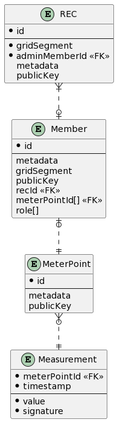

# 7energy backend

## Beschreibung

Hier findet sich der Zwischenstand der Entwicklung eines Backend-Systems für die Verwaltung von Energiegemeinschaften (EGs).  
Kern der Applikation bilden eine objektrelationale Datenbank (vorerst auf sqlite-Basis) und eine auf express.js basierende Rest-API.  

Das grundlegende Datenmodell sieht so aus:



Es wurden 4 zentrale Modelle und ihre Beziehungen definiert und auf Basis des ORM [Sequelize](https://sequelize.org/) implementiert.   
Die im Detail abzubildenden Informationen je Modell (z.B. Adressdaten für Mitglieder, Datentypen für Netz-Segment und Zähler-Messungen) sind noch offen, können aber recht einfach erweitert werden. Um die Komplexität der API niegrig zu halten bzw. Erweiterungen des Datenmodells ohne die Notwendigkeit von API-Anpassungen zu ermöglichen, könnten solche Informationen auch einfach in die Felder namens `metadata` serialisiert werden.

Für die Implementierung eines Zugriffsberechtigungs-Systems wurden folgende Rollen identifiziert: 
* Systemadministrator: kann z.B. neue Energiegemeinschaften anlegen
* Energiegemeinschafts-Administrator: hat Sonderrechte innerhalb einer EG
* Mitglied einer Energiegemeinschaft: kann die eigene Mitgliedschaft verwalten
* Messwert-Orakel: kann Verbrauchsdaten einer EG einspielen

Die weitere Entwicklung sollte in etwa folgendermaßen aussehen:
* Implementierung von Rollen-spezifischen Zugriffsberechtigungen für die API-Endpunkte
* Verifikation der Messpunkt-Daten über die digitale Signatur (benötigt in Haushalten installierte Hardware, welche digital signierte Daten liefert)
* Verfeinerung der API, z.B. durch Update-Methoden, Möglichkeit zum Blättern usw.
* Implementierung von Tests für alle Funktionen

Eine prototypische Implementierung einer Komponente für die Einspeisung von Energiedaten in Echtzeit von einem MQTT-Broker befindet sich in `src/mqttListener.ts`.  
Um diese Anwendung auszuführen, müssen in der Konfigurationsdatei `.env` Zugangsdaten zu einem MQTT-Broker hinterlegt werden.  
Wenn auch die Umgebungsvariable `API` gesetzt ist und auf einen laufenden API-Server zeigt, werden von der Anwendung gelesene Energiedaten über die API laufend persistiert.

## Entwicklung

node.js v14+ und eine dazu passende Version von npm müssen bereits installiert sein.

Um das Projekt für lokale Entwicklung einzurichten, sind folgende Schritte nötig:

Eine Kopie beziehen
```
git clone http://github.com/d10r/7energy-backend
```

Ins Projekt-Verzeichnis wechseln
```
cd 7energy-backend
```

Abhängigkeiten installieren
```
npm ci
```

Dies installiert die zur Auführung nötigen Komponenten, insbesondere auch [sqlite](https://www.sqlite.org), ein leichtgewichtiges DMBS.

Nun kann eine Server-Instanz gestartet werden mit
```
npm start
```

Dies legt beim 1. Aufruf eine leere Datenbank in `db.sqlite` mit dem oben abgebildeten Schema an und stellt eine Rest-API auf Port 8001 zur Verfügung.  
Jetzt kann z.B. auf der Adresse http://localhost:8001/recs eine Liste der EGs im System abgefragt werden. Anfangs ist diese Liste leer.

Es liegt ein Skript bei, um beispielhaft das Einspielen und Auslesen von Daten über die API zu demonstrieren.   
(Vor der Ausführung sollte sichergestellt werden, dass das Paket `jq` installiert ist, z.B. mit `apt install jq` auf Debian-basierten Systemen.)  
Nachdem der Server gestartet und dadurch die Datenbank initialisiert wurde, kann dieses Skript ausgeführt werden:
```
./init-db-with-example-data.sh
```

Dadurch wird eine EG mit einem Mitglied mit einem Zählpunkt angelegt und für diesen Zählpunkt ein Messwert eingetragen.  
Anschließend erfolgt eine Abfrage dieser Daten über die API und eine Ausgabe auf der Konsole.
